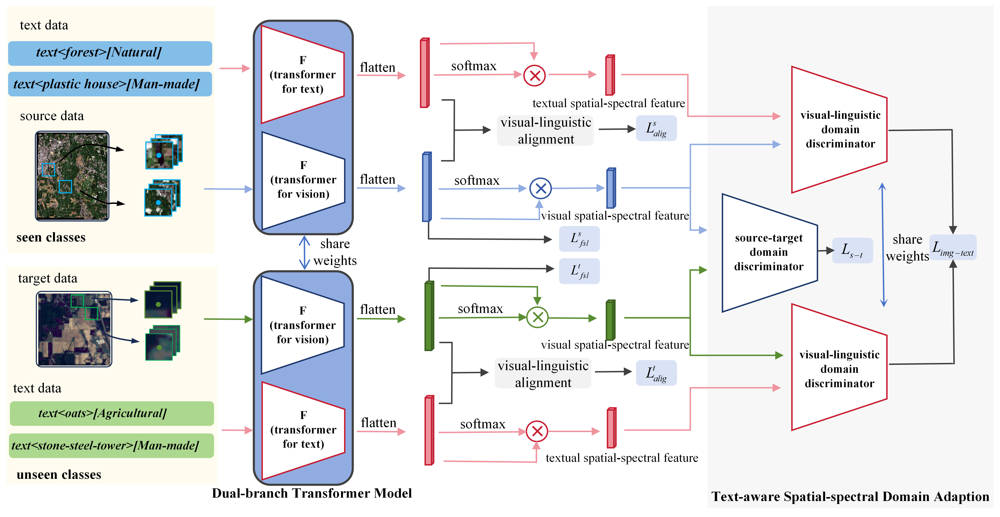

# Text-Aware Few-Shot Learning for Cross-Domain Hyperspectral Image Classification

Thank you for your interest in the code related to our paper, "Text-Aware Few-Shot Learning for Cross-Domain Hyperspectral Image Classification".

# Current Status
The source code for this paper is currently being prepared and will be made available soon. Please check back for updates. We are working to ensure that the code is well-documented and easy to use.

