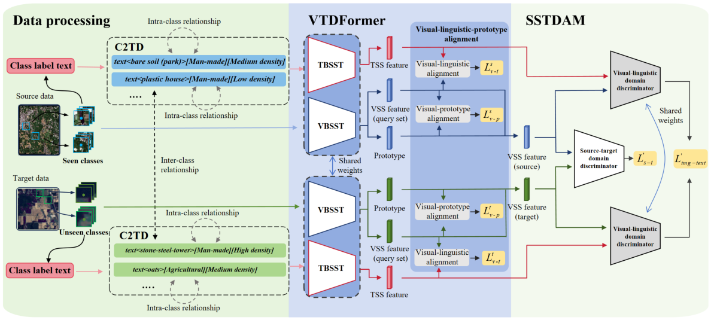

# CGVT-FSL：Concept-Guided Visual-Textual Few-Shot Learning for Cross-Domain Hyperspectral Image Classification

Thank you for your interest in the code related to our paper, "Concept-Guided Visual-Textual Few-Shot Learning for Cross-Domain Hyperspectral Image Classification".

# Abstract

Visual-textual few-shot learning (VT-FSL) models have recently shown great potential in cross-domain hyperspectral image (HSI) classification, as textual descriptions provide domain-invariant semantic knowledge that enhances visual generalization. However, existing VT-FSL methods typically perform global image-label alignment using simple class names or short label phrases, capturing only coarse-grained semantics and lacking explicit conceptual cues aligned with visual spatial-spectral features. Consequently, the resulting visual-textual correspondence remains sensitive to domain shifts. To address this issue, we argue that concept-level semantics such as color, material or density are more stable and transferable across domains. Therefore, we propose a novel concept-guided visual-textual few-shot learning (CGVT-FSL) framework. First, we design a concept-embedded class-label text description (C2TD) method that incorporates LLM-generated concept knowledge into class-level textual representations, enabling interpretable and transferable semantic alignment. Second, we develop a visual-textual dual-branch transformer (VTDFormer), which jointly extracts visual and textual spatial-spectral features across domains. Moreover, a spatial-spectral-textual domain adversarial module (SSTDAM) is introduced to further mitigate domain shift by leveraging the shared concept-embedded linguistic domain. Extensive experiments on six HSI datasets demonstrate that CGVT-FSL consistently outperforms state-of-the-art FSL methods.

# Current Status
The source code for this paper is currently being prepared and will be made available soon. Please check back for updates. We are working to ensure that the code is well-documented and easy to use.

